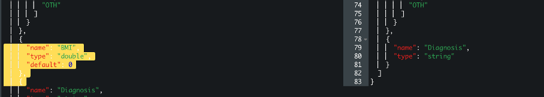
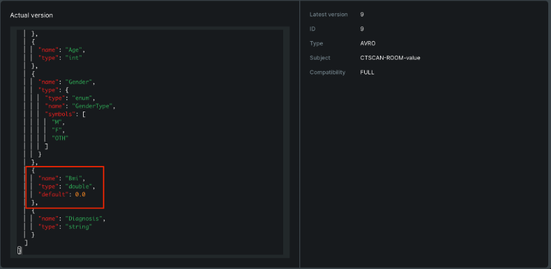
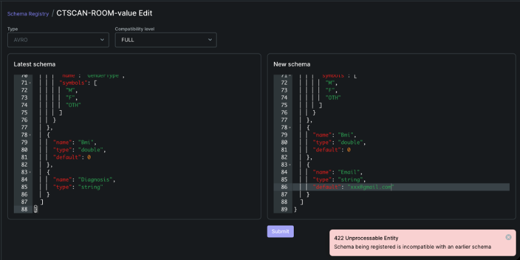
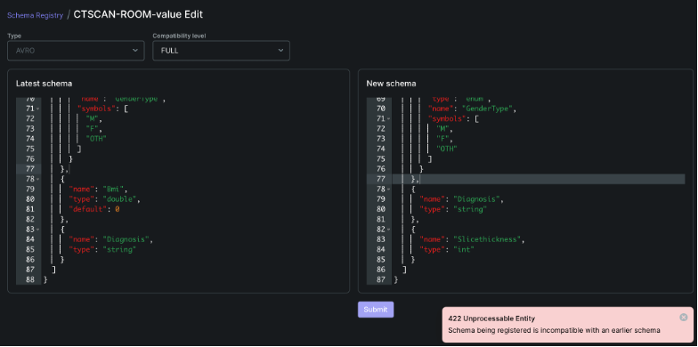
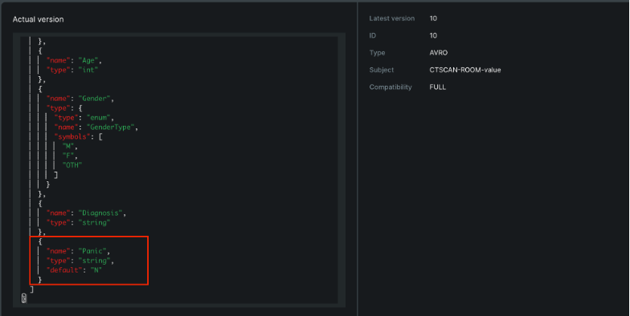

# 🏥 Schema Registry Implementation for Hospital CT Scan Data Transfer

## Group members
1. Sumonsiri Techasuntharowat 6720422007
2. Sahaphum Ketkaew 6720422010
3. Kritsada Matkaruchit 6720422028

---

## 📑 Table of Content
1. [Overview](#1-overview)
2. [Specific Details](#2-specific-details)
3. [Existing Issues](#3-existing-issues)
4. [Motivation](#4-motivation)
5. [Problem Statement](#5-problem-statement)
6. [Experimental Results](#6-experimental-results)
7. [Conclusion](#7-Conclusion)

---

## 1. Overview
Schema Registry เป็นระบบจัดการรูปแบบข้อมูลแบบรวมศูนย์สำหรับข้อมูล CT Scan ข้ามแผนกต่างๆ ในโรงพยาบาล ช่วยให้ข้อมูลจากห้อง CT Scan สามารถส่งไปยังแผนกต่างๆ เช่น Oncology dep, Cardiology dep, Orthopedics dep ได้อย่างสม่ำเสมอ โดยแต่ละแผนกสามารถเข้าถึงเฉพาะข้อมูลในส่วนที่เกี่ยวข้องกับงานทางคลินิกของตน ระบบนี้ช่วยในการแบ่งข้อมูลด้วยกรอบการตรวจสอบความถูกต้องของ schema ที่บังคับใช้ ซึ่งออกแบบมาโดยเฉพาะสำหรับขั้นตอนการทำงานด้านการถ่ายภาพทางการแพทย์

---

## 2. Specific Details
ในขั้นตอนการทำงานของ CT Scan เมื่อแพทย์รังสีทำการสแกนเสร็จสิ้น แอปพลิเคชัน Producer จะทำการ Serialize ข้อมูลผู้ป่วยตาม Schema ที่กำหนดไว้ และฝัง Schema ID ในแต่ละข้อความที่ส่งไปยัง Kafka Topics แผนกต่างๆ ที่เป็น Consumer จากนั้น Consumer จะดึงข้อความที่มีเฉพาะฟิลด์ที่ต้องการ โดยทั้งหมดนี้จะใช้ schema เดียวกันจาก Schema registry ซึ่งมีการบังคับใช้กฎความเข้ากันได้ เช่น Backward, Forward หรือ Full เพื่อให้แน่ใจว่าเมื่อมีการเพิ่มฟิลด์ใหม่ เช่น Radiation dose หรือ BMI ระบบของแผนกที่มีอยู่จะยังคงทำงานได้โดยไม่เกิดความเสียหาย ทำให้สามารถค่อยๆ ปรับใช้การอัปเดต schema ทั่วทั้งโรงพยาบาล

---

## 3. Existing Issues
ในปัจจุบันโรงพยาบาลตหลายแห่งประสบปัญหาที่สำคัญเมื่อแผนกต่างๆ ใช้ข้อมูล CT Scan โดยไม่มีระบบจัดการ schema แบบรวมศูนย์ ซึ่งนำไปสู่ความไม่สอดคล้องของข้อมูล โดยแต่ละแผนกอาจจะใช้ข้อมูลในฟิลด์ที่แตกต่างกัน เมื่อมีการเปลี่ยนแปลงรูปแบบข้อมูล แต่ละแผนกจำเป็นจะต้องประสานงานทางตรง เช่น การสื่อสารผ่านอีเมล การประชุม ซึ่งอาจทำให้เกิดความล่าช้าและมีความเสี่ยงในการสื่อสารที่ผิดพลาด นอกจากนี้ยังมีเรื่องของความขัดแย้งของเวอร์ชัน เมื่อทีม CT Scan ทำการอัปเดตรูปแบบการส่งออกข้อมูล แต่บางแผนกยังไม่ได้อัปเดตแอปพลิเคชันที่ใช้ข้อมูล ส่งผลให้ data pipeline เสียหายและอาจสูญเสียข้อมูลทางคลินิกที่สำคัญระหว่างขั้นตอนการดูแล สุดท้ายอาจนำไปสู่ข้อผิดพลาดในการดูแลรักษาผู้ป่วยได้

---

## 4. Motivation
การนำ Schema Registry มาใช้ตอบสนองความจำเป็น สำหรับการกำกับดูแลข้อมูลภายในโรงพยาบาล ซึ่งความปลอดภัยของผู้ป่วยขึ้นอยู่กับข้อมูลทางการแพทย์ที่ถูกต้องและมีความสอดคล้องกัน

### 💡 ประโยชน์หลักสำหรับโรงพยาบาล
* **Safe Evolution:** พัฒนา Schema ได้ปลอดภัย เมื่อความต้องการข้อมูลทางคลินิกเปลี่ยนแปลง
* **Faster Integration:** ลดระยะเวลาในการเชื่อมต่อระบบใหม่ เมื่อมีการเพิ่มแผนกในอนาคต
* **Data Integrity:** รองรับความสมบูรณ์ของข้อมูลเพื่อความปลอดภัยของผู้ป่วย
* **Standards Compliance:** รองรับการทำงานร่วมกับมาตรฐานของโรงพยาบาล
* **Zero Downtime:** เพิ่มฟิลด์ข้อมูลใหม่ได้โดยไม่ต้องหยุดการทำงานของระบบ

---

## 5. Problem Statement

### 📥 ข้อมูลนำเข้า (Input)
ข้อมูลจาก CT Scan ประกอบด้วยข้อมูลสำคัญ 4 ส่วน:
* **Patient Demographics:** HN, Name, Surname, Telephone, Age, Gender
* **Scan Metadata:** ScanDate, Room_Number, ScanID, CTSCAN_Type, Radiologist
* **Imaging Details:** RadiationDose
* **Findings:** Diagnosis

### 🎯 วัตถุประสงค์ (Objective)
1. ออกแบบและนำระบบ Schema Registry มาใช้ เพื่อเปิดใช้งานการดึงข้อมูลแบบเลือกเฉพาะฟิลด์
2. รักษาความสมบูรณ์ของข้อมูลระหว่างการอัปเกรดเวอร์ชัน
3. บังคับใช้กฎ **Compatibility Rules** เพื่อป้องกันการเปลี่ยนแปลงที่ทำให้ระบบล่ม
4. จัดให้มีระบบ Version Control สำหรับข้อมูลทางการแพทย์
5. รับประกันการปฏิบัติตามมาตรฐานข้อมูลการดูแลสุขภาพ

---

## 6. Experimental Results

### 6.1 โหมด Backward Compatibility (Default)
**สถานการณ์:** แผนกมะเร็งวิทยาต้องการเพิ่มฟิลด์ใหม่ `TumorSize`

| กรณีทดสอบ | การดำเนินการ | ผลลัพธ์ | ผลกระทบ |
| :--- | :--- | :--- | :--- |
| เพิ่มฟิลด์ Optional | เพิ่ม `TumorSize` (default: null) | ✅ สำเร็จ | Consumers เก่ายังทำงานได้ปกติ |
| ลบฟิลด์ Optional | ลบ `Room_Number` | ✅ สำเร็จ | Consumers ใหม่สามารถข้ามฟิลด์นี้ได้ |
| เพิ่มฟิลด์ Required | เพิ่ม `InsuranceNumber` (บังคับ) | ❌ ปฏิเสธ | ป้องกัน Consumer เดิมพังเพราะไม่มีฟิลด์นี้ |
| เปลี่ยน Data Type | เปลี่ยน `Age` จาก int → string | ❌ ปฏิเสธ | ทำลายความเข้ากันได้ของระบบปลายทาง |

> **💡 สรุป:** Backward Mode เหมาะสำหรับการอัปเกรดฝั่ง Consumer ก่อนเพื่อเตรียมรับข้อมูลใหม่

---

### 6.2 โหมด Forward Compatibility
**สถานการณ์:** ห้อง CT Scan อัปเกรดเครื่องมือและต้องการส่งข้อมูล `RadiationDose` ทันที

| กรณีทดสอบ | การดำเนินการ | ผลลัพธ์ | ผลกระทบ |
| :--- | :--- | :--- | :--- |
| เพิ่มฟิลด์ใหม่ | เพิ่ม `RadiationDose` | ✅ สำเร็จ | Consumer เก่าจะเพิกเฉยฟิลด์ที่เพิ่มมา |
| ลบฟิลด์ Optional | ลบ `Room_Number` | ✅ สำเร็จ | ระบบเดิมยังทำงานต่อได้ไม่มีปัญหา |
| เพิ่มฟิลด์ Required | เพิ่ม `ContrastBatchNumber` | ❌ ปฏิเสธ | Consumer เก่าจะไม่รองรับข้อมูลนี้ |

---

### 6.3 Full Compatibility (Bidirectional/Full mode)

### 6.3.1 Delete Column: No Default Value
* **Action:** Delete `Telephone`
* **Status:** Unable to delete (422 Unprocessable Entity)

  

### 6.3.2 Delete Column: With Default Value
* **Action:** Delete `BMI`
* **Status:** Success

  

### 6.3.3 New Column: No Default Value
* **Action:** Insert `Address`
* **Status:** Unable to Insert

  

### 6.3.4 New Column: With Default Value
* **Action:** Insert `BMI`
* **Status:** Success

  

### 6.3.5 Delete Multiple: No Default Values
* **Action:** Delete `Telephone` and `Diagnosis`
* **Status:** Unable to Delete

  

### 6.3.6 Delete Multiple: Mixed (No Default + Default)
* **Action:** Delete `Diagnosis` and `BMI`
* **Status:** Unable to Delete

  

### 6.3.7 Delete (No Default) & Insert (No Default)
* **Action:** Delete `Diagnosis`, Insert `Slicethickness`
* **Status:** Unable to Delete/Insert

  

### 6.3.8 Delete (No Default) & Insert (With Default)
* **Action:** Delete `Diagnosis`, Insert `Email`
* **Status:** Unable to Delete/Insert

  

### 6.3.9 Delete Multiple: All with Defaults
* **Action:** Delete `Bloodgroup`, Delete `Radiationdose`
* **Status:** Success

  

### 6.3.10 Delete (With Default) & Insert (No Default)
* **Action:** Delete `BMI`, Insert `Slicethickness`
* **Status:** Unable to Delete/Insert

  

### 6.3.11 Delete (With Default) & Insert (With Default)
* **Action:** Delete `BMI`, Insert `Panic`
* **Status:** Success

  

### 6.3.12 New Column & New Column (Mixed)
* **Action:** Insert `Address` (No Default), Insert `Slicethickness` (Default)
* **Status:** Unable to Insert

  

### 6.3.13 New Column & New Column (Both with Defaults)
* **Action:** Insert `Slicethickness`, Insert `Radiationdose`
* **Status:** Success

   **Key Rule:** เพื่อให้มั่นใจว่า Schema จะเข้ากันได้แบบ **Backward** และ **Full** คอลัมน์ที่ถูกเพิ่มเข้า หรือลบออกทั้งหมด **ต้องมีการระบุค่าเริ่มต้น (Default Values) ไว้เสมอ**
