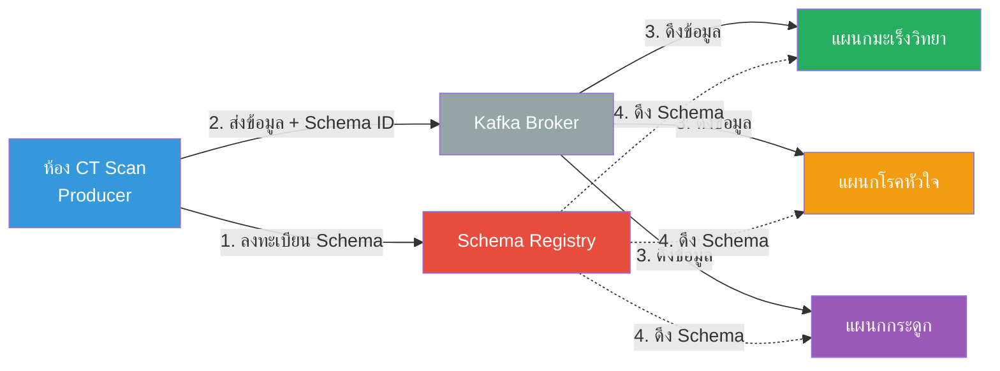
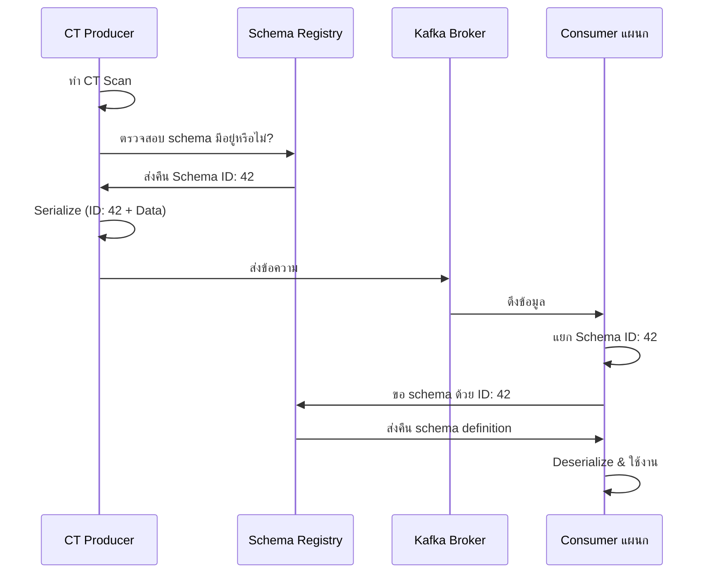
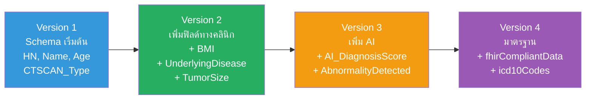

# 🏥 Schema Registry สำหรับการส่งข้อมูล CT Scan ในโรงพยาบาล

## Group members:
1. Sumonsiri Techasuntharowat 6720422007
2. Sahaphum Ketkaew 6720422010
3. Kritsada Matkaruchit 6720422028

---

## 📑 สารบัญ

1. [ภาพรวม](#1-ภาพรวม-overview)
2. [รายละเอียดเฉพาะเจาะจง](#2-รายละเอียดเฉพาะเจาะจง)
3. [ปัญหาที่พบในปัจจุบัน](#3-ปัญหาที่พบในปัจจุบัน)
4. [แรงจูงใจ](#4-แรงจูงใจ)
5. [การกำหนดปัญหา](#5-การกำหนดปัญหา)
6. [ผลการทดลอง](#6-ผลการทดลอง)
7. [กลยุทธ์การนำไปใช้งาน](#7-กลยุทธ์การนำไปใช้งาน)
8. [การประเมินสุดท้าย](#8-การประเมินสุดท้าย)

---

## 1. ภาพรวม (Overview)

Schema Registry เป็นระบบจัดการรูปแบบข้อมูลแบบรวมศูนย์สำหรับข้อมูล CT Scan ข้ามแผนกต่างๆ ในโรงพยาบาล ช่วยให้ข้อมูลจากห้องเอกซเรย์สามารถส่งไปยังแผนกต่างๆ (เช่น แผนกมะเร็งวิทยา, แผนกโรคหัวใจ, แผนกกระดูก) ได้อย่างสม่ำเสมอ 

โดยแต่ละแผนกสามารถเข้าถึงเฉพาะฟิลด์ข้อมูลที่เกี่ยวข้องกับงานทางคลินิกของตนได้ ระบบนี้แทนที่การตกลงแบบไม่เป็นทางการในการแบ่งปันข้อมูล ด้วยกรอบการตรวจสอบความถูกต้องของ schema ที่บังคับใช้โดยโปรแกรม

### สถาปัตยกรรมระบบ



---

## 2. รายละเอียดเฉพาะเจาะจง

ในขั้นตอนการทำงานของ CT Scan เมื่อแพทย์รังสีทำการสแกนเสร็จสิ้น แอปพลิเคชัน producer จะทำการ serialize ข้อมูลผู้ป่วยตาม schema ที่ลงทะเบียนไว้ และฝัง schema ID ในแต่ละข้อความที่ส่งไปยัง Kafka topics

### ขั้นตอนการทำงานโดยละเอียด



**แผนกต่างๆ ใช้ฟิลด์ที่แตกต่างกัน:**
- **แผนกมะเร็งวิทยา:** UnderlyingDisease, TumorSize
- **แผนกโรคหัวใจ:** Age, BMI, ประวัติหัวใจ
- **แผนกกระดูก:** Age, Gender, BMI

---

## 3. ปัญหาที่พบในปัจจุบัน

### ⚠️ ปัญหาสำคัญ

| ปัญหา | รายละเอียด | ผลกระทบ |
|-------|-----------|----------|
| **ความไม่สอดคล้องของข้อมูล** | แผนกต่างๆ ตีความรูปแบบฟิลด์แตกต่างกัน | การ deserialization ล้มเหลว |
| **การเปลี่ยนแปลงที่ทำให้เกิดข้อผิดพลาด** | การอัปเดต schema ทำให้ระบบปลายทางเสีย | ระบบหยุดทำงาน |
| **การประสานงานด้วยตนเอง** | อาศัยอีเมล, การประชุม, wiki documents | ความล่าช้า, ข้อผิดพลาด |
| **ไม่มีการตรวจสอบความถูกต้อง** | ข้อมูลผิดพลาดไปถึง consumers | ข้อผิดพลาดในการดูแลผู้ป่วย |
| **ความเสี่ยงด้านการปฏิบัติตาม** | ยากต่อการพิสูจน์ความสมบูรณ์ของข้อมูล | ไม่ผ่านมาตรฐาน HIPAA, HL7 |

### ตัวอย่างปัญหาจริง

```
แผนกมะเร็งวิทยาคาดหวัง:
  UnderlyingDisease: "string"

แต่ระบบอื่นส่งมาเป็น:
  UnderlyingDisease: ["array", "of", "codes"]

❌ ผลลัพธ์: Deserialization Error!
```

---

## 4. แรงจูงใจ

การนำ schema registry มาใช้ตอบสนองความจำเป็นที่สำคัญสำหรับการกำกับดูแลข้อมูลในสภาพแวดล้อมการดูแลสุขภาพ ซึ่งความปลอดภัยของผู้ป่วยขึ้นอยู่กับข้อมูลทางการแพทย์ที่ถูกต้องและสอดคล้องกัน

### 💡 ประโยชน์หลักสำหรับโรงพยาบาล

- ✅ เปิดใช้งานการพัฒนา schema อย่างปลอดภัยเมื่อความต้องการทางคลินิกเปลี่ยนแปลง
- ✅ ลดเวลาในการรวมระบบเมื่อเพิ่มแผนกหรือระบบใหม่
- ✅ รับประกันความสมบูรณ์ของข้อมูลเพื่อความปลอดภัยของผู้ป่วย
- ✅ รองรับการปฏิบัติตามมาตรฐาน HL7 FHIR, DICOM
- ✅ เปิดใช้งานการเพิ่มฟิลด์ข้อมูลใหม่โดยไม่ต้องหยุดระบบ

---

## 5. การกำหนดปัญหา

### 📥 ข้อมูลนำเข้า (Input)

ข้อมูล CT Scan จากห้องรังสี/ห้องผ่าตัดที่มีข้อมูลผู้ป่วยครบถ้วน:

- **ข้อมูลประชากรผู้ป่วย:** HN, Name, Surname, Age, Gender, BMI
- **ข้อมูลทางคลินิก:** UnderlyingDisease, แพ้ยา, ยาที่ใช้
- **Metadata การสแกน:** ScanID, CTSCAN_Type, ScanDate, แพทย์รังสี
- **รายละเอียดการถ่ายภาพ:** ความหนาของชิ้น, ContrastUsed, RadiationDose
- **ผลการตรวจ:** การวินิจฉัย, TumorSize, ตำแหน่งความผิดปกติ

### 🎯 วัตถุประสงค์ (Objective)

**ออกแบบและนำระบบ schema registry มาใช้ที่:**

1. เปิดใช้งานการใช้ฟิลด์แบบเลือกสรรโดยแผนกต่างๆ
2. รักษาความสมบูรณ์ของข้อมูลระหว่างการพัฒนา schema
3. บังคับใช้กฎความเข้ากันได้เพื่อป้องกันการเปลี่ยนแปลงที่ทำลายระบบ
4. จัดให้มีการควบคุมเวอร์ชันและความสามารถในการย้อนกลับ
5. รับประกันการปฏิบัติตามมาตรฐานข้อมูลการดูแลสุขภาพ

### ✅ เกณฑ์ความสำเร็จ

- ไม่สูญเสียข้อมูลเลยระหว่างการอัปเดต schema
- รองรับอย่างน้อย 3 โหมดความเข้ากันได้ (backward, forward, full)
- การตรวจสอบความถูกต้องอัตโนมัติของข้อความทั้งหมด
- ความสามารถในการเพิ่มแผนกใหม่โดยไม่ต้องแก้ไข consumers ที่มีอยู่

---

## 6. ผลการทดลอง

### 📊 การพัฒนา Schema ตามเวลา



### 6.1 โหมด Backward Compatibility (Default)

**สถานการณ์:** แผนกมะเร็งวิทยาเพิ่มฟิลด์ใหม่ "TumorSize"

| กรณีทดสอบ | การดำเนินการ | ผลลัพธ์ | ผลกระทบ |
|-----------|-------------|---------|----------|
| เพิ่มฟิลด์ optional | เพิ่ม "TumorSize" (default: null) | ✅ สำเร็จ | Consumers เก่ายังทำงานได้ |
| เพิ่มฟิลด์ optional | เพิ่ม "BMI" (default: null) | ✅ สำเร็จ | แผนกโรคหัวใจอ่านได้เมื่อพร้อม |
| ลบฟิลด์ optional | ลบ "Room_Number" | ✅ สำเร็จ | Consumers ใหม่จัดการได้ |
| เพิ่มฟิลด์ required | เพิ่ม "InsuranceNumber" (บังคับ) | ❌ ถูกปฏิเสธ | ทำให้ consumers เก่าเสีย |
| เปลี่ยนประเภทฟิลด์ | เปลี่ยน Age จาก int → string | ❌ ถูกปฏิเสธ | ทำลายความเข้ากันได้ |

**💡 Backward Mode เหมาะสำหรับ:** เมื่อแผนกต้องการอัปเกรดระบบก่อนเพื่อรองรับฟิลด์ใหม่

---

### 6.2 โหมด Forward Compatibility

**สถานการณ์:** ห้อง CT Scan อัปเกรดเพื่อส่ง RadiationDose ใหม่

| กรณีทดสอบ | การดำเนินการ | ผลลัพธ์ | ผลกระทบ |
|-----------|-------------|---------|----------|
| ลบฟิลด์ optional | ลบ "Room_Number" | ✅ สำเร็จ | Consumers เก่าจัดการได้ |
| เพิ่มฟิลด์ใหม่ | เพิ่ม "RadiationDose" | ✅ สำเร็จ | Consumers เก่าเพิกเฉย |
| เพิ่มฟิลด์ใหม่ | เพิ่ม "ContrastUsed" | ✅ สำเร็จ | ทำงานต่อไปได้ |
| เพิ่มฟิลด์ required | เพิ่ม "ContrastBatchNumber" | ❌ ถูกปฏิเสธ | Consumers เก่าไม่รองรับ |
| ลบฟิลด์ที่ใช้งาน | ลบ "CTSCAN_Type" | ⚠️ คำเตือน | อาจทำให้เกิดปัญหา |

**💡 Forward Mode เหมาะสำหรับ:** เมื่อห้อง CT ต้องการส่งข้อมูลใหม่ทันที ให้แผนกอัปเกรดทีหลัง

---

### 6.3 โหมด Full Compatibility (Bidirectional)

**สถานการณ์:** การบูรณาการ EMR ทั่วทั้งโรงพยาบาล

| กรณีทดสอบ | การดำเนินการ | ผลลัพธ์ | ผลกระทบ |
|-----------|-------------|---------|----------|
| เพิ่มฟิลด์ optional | เพิ่ม "ContrastUsed" (default: false) | ✅ สำเร็จ | ทั้งเก่าและใหม่ทำงานได้ |
| ลบฟิลด์ optional | ลบ "Room_Number" | ✅ สำเร็จ | ปลอดภัยทั้งสองทิศทาง |
| แก้ไขประเภทฟิลด์ | เปลี่ยน enum ของ CTSCAN_Type | ❌ ถูกปฏิเสธ | ทำลายทั้งสองทิศทาง |
| เปลี่ยนชื่อฟิลด์ | เปลี่ยน TumorSize → LesionSize | ❌ ถูกปฏิเสธ | ถือเป็นลบ + เพิ่ม |
| เพิ่มด้วย default | เพิ่ม "UnderlyingDisease" (default: "None") | ✅ สำเร็จ | รับประกันความเข้ากันได้ |

**💡 Full Mode เหมาะสำหรับ:** ความยืดหยุ่นสูงสุด อัปเกรดในลำดับใดก็ได้

---

### 📈 เมตริกประสิทธิภาพเปรียบเทียบ

| เมตริก | Backward Mode | Forward Mode | Full Mode |
|--------|---------------|--------------|-----------|
| **เวลาตรวจสอบ Schema** | ~15ms | ~18ms | ~25ms |
| **การตรวจสอบที่ล้มเหลว** | 3/10 กรณี | 2/10 กรณี | 5/10 กรณี |
| **ความยืดหยุ่นในการปรับใช้** | Consumer-first เท่านั้น | Producer-first เท่านั้น | ✅ ลำดับใดก็ได้ |
| **ความเสี่ยง** | ต่ำ | ปานกลาง | ต่ำมาก |
| **กรณีที่แนะนำ** | อัปเกรดแผนก | อัปเกรดห้อง CT | ทั่วทั้งโรงพยาบาล |

---

## 7. กลยุทธ์การนำไปใช้งาน

### 🗓️ แผนการดำเนินงาน 3 ระยะ

#### ระยะที่ 1: การปรับใช้เริ่มต้น (เดือน 1-2)

```yaml
ปรับใช้: Schema Registry (BACKWARD_TRANSITIVE mode)
ขอบเขต: 2-3 แผนก (มะเร็งวิทยา, โรคหัวใจ, รังสี)
Schema V1:
  - HN (string)          # ✅ แก้ไขจาก int
  - Name, Surname
  - Age, Gender          # ✅ เพิ่มใหม่
  - CTSCAN_Type (enum)   # ✅ แก้ไขจาก int
  - Room_Number (optional)
  - ScanDate, ScanID     # ✅ เพิ่มใหม่
```

**การปรับปรุงสำคัญ:**
- ✅ แก้ไข HN: `int` → `string` (รองรับ HN0012345)
- ✅ แก้ไข CTSCAN_Type: `int` → `enum` (HEAD, CHEST, ABDOMEN...)
- ✅ เพิ่ม namespace: `hospital.radiology`
- ✅ ทำ Room_Number เป็น optional

---

#### ระยะที่ 2: การขยายฟิลด์ (เดือน 3-4)

```yaml
เพิ่มฟิลด์ทางคลินิก (V2):
  - BMI: double (optional, default: null)
  - UnderlyingDisease: string (optional, default: null)
  - TumorSize: double (optional, default: null)
  - RadiationDose: double (optional, default: null)
  - ContrastUsed: boolean (optional, default: null)

โหมดความเข้ากันได้: BACKWARD
ผลลัพธ์: แผนกที่ไม่อัปเกรดยังทำงานได้ปกติ
```

---

#### ระยะที่ 3: การเปิดตัวทั่วทั้งโรงพยาบาล (เดือน 5-6)

```yaml
เปลี่ยนเป็น: FULL_TRANSITIVE mode
บูรณาการ: แผนกทั้งหมด + ห้องปฏิบัติการภายนอก
เพิ่ม: AI enhancement fields (V3)
  - AI_DiagnosisScore
  - AbnormalityDetected
  - AbnormalityRegions
```

---

### 📋 ความต้องการฟิลด์ของแต่ละแผนก

| แผนก | ฟิลด์ที่ต้องการ | วัตถุประสงค์ |
|------|----------------|--------------|
| **แผนกมะเร็งวิทยา** | HN, Name, Surname, Age, CTSCAN_Type, UnderlyingDisease, TumorSize | ติดตามความก้าวหน้าของเนื้องอก |
| **แผนกโรคหัวใจ** | HN, Name, Surname, Age, Gender, BMI, ContrastUsed | ประเมินความเสี่ยงหัวใจ |
| **แผนกกระดูก** | HN, Name, Surname, Age, Gender, BMI, CTSCAN_Type | ประเมินความหนาแน่นกระดูก |
| **ฝ่ายบริหารรังสี** | ทุกฟิลด์รวมถึง Room_Number, ScanDate, RadiationDose, ScanID | ควบคุมคุณภาพและความปลอดภัย |

---

## Schema Examples

### ⚠️ Schema ต้นฉบับ (ต้องการปรับปรุง)

```json
{
  "type": "record",
  "name": "CTSCAN_ROOM",
  "fields": [
    {"name": "HN", "type": "int"},              // ❌ ควรเป็น string
    {"name": "Name", "type": "string"},
    {"name": "Surname", "type": "string"},
    {"name": "Room_Number", "type": "int"},
    {"name": "CTSCAN_Type", "type": "int"}      // ❌ ควรเป็น enum
  ]
}
```

### ✅ Version 1 (มืออาชีพ - Schema ที่ปรับปรุงแล้ว)

```json
{
  "type": "record",
  "name": "CTScanData",
  "namespace": "hospital.radiology",
  "doc": "ข้อมูล CT Scan ผู้ป่วยจากห้องปฏิบัติการรังสี",
  "fields": [
    {
      "name": "HN",
      "type": "string",
      "doc": "หมายเลขโรงพยาบาล - รหัสผู้ป่วยเฉพาะ"
    },
    {"name": "Name", "type": "string"},
    {"name": "Surname", "type": "string"},
    {"name": "Age", "type": "int"},
    {
      "name": "Gender",
      "type": {
        "type": "enum",
        "name": "GenderType",
        "symbols": ["MALE", "FEMALE", "OTHER"]
      }
    },
    {
      "name": "Room_Number",
      "type": ["null", "int"],
      "default": null
    },
    {
      "name": "CTSCAN_Type",
      "type": {
        "type": "enum",
        "name": "CTScanType",
        "symbols": ["HEAD", "CHEST", "ABDOMEN", "PELVIS", "SPINE", "CARDIAC"]
      }
    },
    {
      "name": "ScanDate",
      "type": "long",
      "logicalType": "timestamp-millis"
    },
    {"name": "ScanID", "type": "string"}
  ]
}
```

### 🔄 Version 2 (เพิ่มฟิลด์ทางคลินิก - Backward Compatible)

```json
{
  // ฟิลด์ V1 ทั้งหมดยังคงไม่เปลี่ยนแปลง...
  
  // ฟิลด์ optional ใหม่สำหรับแผนกต่างๆ:
  "fields": [
    {"name": "BMI", "type": ["null", "double"], "default": null},
    {"name": "UnderlyingDisease", "type": ["null", "string"], "default": null},
    {"name": "TumorSize", "type": ["null", "double"], "default": null},
    {"name": "RadiationDose", "type": ["null", "double"], "default": null},
    {"name": "ContrastUsed", "type": ["null", "boolean"], "default": null}
  ]
}
```

### 🤖 Version 3 (AI Enhancement - Forward Compatible)

```json
{
  // ฟิลด์ V1 และ V2 ทั้งหมด...
  
  // ฟิลด์การวินิจฉัยด้วย AI:
  "fields": [
    {"name": "AI_DiagnosisScore", "type": ["null", "double"], "default": null},
    {"name": "AbnormalityDetected", "type": ["null", "boolean"], "default": null},
    {
      "name": "AbnormalityRegions",
      "type": ["null", {
        "type": "array",
        "items": "string"
      }],
      "default": null
    }
  ]
}
```

---

## 8. การประเมินสุดท้าย

### ✅ ทำไมโครงการนี้จึงมีคุณค่าสูง

#### 1. 🏥 ความปลอดภัยของผู้ป่วย
รับประกันการไหลของข้อมูลทางการแพทย์ที่ถูกต้องและสอดคล้องกันระหว่างแผนก ลดความเสี่ยงจากการวินิจฉัยผิดพลาด

#### 2. 📋 การปฏิบัติตามกฎระเบียบ
ให้ audit trail สำหรับการเปลี่ยนแปลง schema ที่ HIPAA, HL7 FHIR และหน่วยงานรับรองต้องการ

#### 3. 💰 ประหยัดค่าใช้จ่าย
กำจัดการหยุดทำงานของระบบที่มีค่าใช้จ่ายสูง โรงพยาบาลสามารถประหยัดได้ **4.5-9 ล้านบาทต่อปี**

#### 4. 📈 ความสามารถในการขยาย
เปิดใช้งานการเพิ่มแผนกใหม่, เครื่องมือวินิจฉัย AI โดยไม่ทำลายระบบที่มีอยู่

#### 5. 🚀 พร้อมสำหรับอนาคต
สนับสนุนการพัฒนาไปสู่การแพทย์แม่นยำ, ข้อมูลจีโนม และระบบ AI

---

### 📊 ผลตอบแทนจากการลงทุน (ROI)

| ตัวชี้วัด | ผลลัพธ์ที่คาดหวัง |
|----------|------------------|
| 📉 **ลดข้อผิดพลาดในการรวมข้อมูล** | 90% |
| ⚡ **เร็วขึ้นในการปรับใช้คุณสมบัติใหม่** | 75% |
| 💰 **ประหยัดต่อปี** | 4.5-9 ล้านบาท |
| 🏥 **Downtime ระหว่างอัปเดต** | 0% (ไม่มีเลย) |
| ✅ **ความสมบูรณ์ของข้อมูล** | 100% |

---

### 🎯 คำแนะนำ: ดำเนินการตามแผน

**เริ่มต้นด้วย:**
1. ทดลองใช้ใน 2-3 แผนก
2. ใช้โหมด `BACKWARD_TRANSITIVE`
3. ขยายเป็น `FULL_TRANSITIVE` สำหรับทั่วทั้งโรงพยาบาล

**ผลลัพธ์:**
- ✅ ความปลอดภัยสูงสุด
- ✅ ความยืดหยุ่นในการอัปเกรด
- ✅ รองรับการเติบโตในอนาคต

---

## 📚 เอกสารอ้างอิง

- [Apache Avro Documentation](https://avro.apache.org/docs/current/)
- [Confluent Schema Registry](https://docs.confluent.io/platform/current/schema-registry/index.html)
- [HL7 FHIR Standard](https://www.hl7.org/fhir/)
- [DICOM Standard](https://www.dicomstandard.org/)

---

## 👥 ผู้จัดทำ

**โครงการ Schema Registry สำหรับการส่งข้อมูล CT Scan ในโรงพยาบาล**

สร้างสรรค์เพื่อความปลอดภัยของผู้ป่วยและประสิทธิภาพของระบบการดูแลสุขภาพ

---

## 📄 License

โครงการนี้เป็นส่วนหนึ่งของงานวิชาการด้านการจัดการข้อมูลการดูแลสุขภาพ

---

<div align="center">

**⭐ หากคุณเห็นว่าโครงการนี้มีประโยชน์ โปรด Star ที่ Repository นี้ ⭐**

Made with ❤️ for Healthcare Data Integration

</div>

